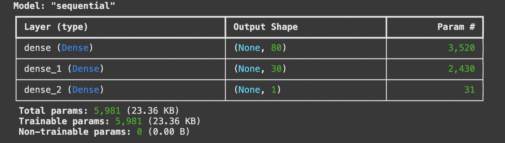
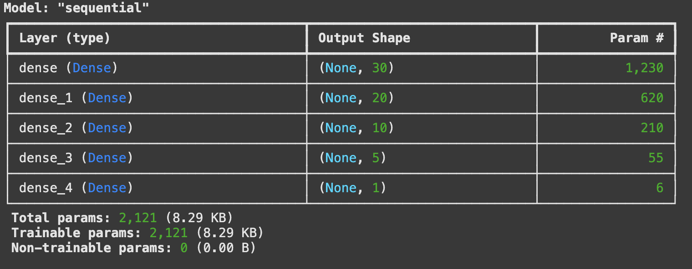
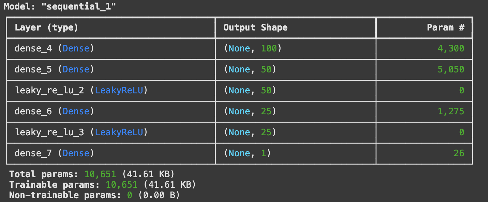
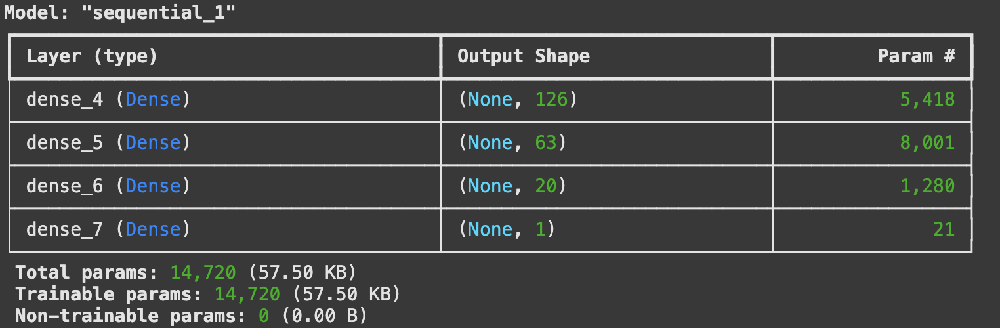

# Deep Learning Model for Funding Prediction
## Overview 
This analysis aims to develop a deep learning model to help the nonprofit foundation, Alphabet Soup, identify applicants most likely to succeed with funding. The dataset includes over 34,000 organizations that have received funding, with features capturing various metadata about each organization.

## Files and Folders:
* Images: This folder contains visual representations of the deep learning model architectures, illustrating the layers and the number of neurons in each.

* models_saved: Stores the trained models as .h5 files for reuse and evaluation.

* AlphabetSoupCharity.ipynb: The initial deep learning model before optimization.

* AlphabetSoupCharity_Optimization1.ipynb, AlphabetSoupCharity_Optimization2.ipynb, AlphabetSoupCharity_Optimization3.ipynb: These are progressively optimized versions of the original model. Each version explores different configurations of layers, neurons, activation functions, and epochs to determine whether the target accuracy of 75% can be achieved.
## Dataset Features
* Identification: EIN, NAME
* Application type: APPLICATION_TYPE
* Affiliated sector of industry: AFFILIATION
* Government organization classification: CLASSIFICATION
* Use case for funding: USE_CASE
* Organization type: ORGANIZATION
* Active status: STATUS
* Income classification: INCOME_AMT
* Special considerations for application: SPECIAL_CONSIDERATIONS
* Funding amount requested: ASK_AMT
* Was the money used effectively : IS_SUCCESSFUL

## Preprocess the Data
* Target variable (y): IS_SUCCESSFUL
* Features variable (X): APPLICATION_TYPE, AFFILIATION, CLASSIFICATION, USE_CASE, ORGANIZATION, STATUS, INCOME_AMT, SPECIAL_CONSIDERATIONS, ASK_AMT.
* Dropped Columns: EIN, NAME (not relevant for prediction)
* Unique Value Analysis:
    * APPLICATION_TYPE, CLASSIFICATION, and ASK_AMT had more than 10 unique values.
    * APPLICATION_TYPE categories with fewer than 500 occurrences were grouped as "Other."
    * CLASSIFICATION categories with fewer than 1,883 occurrences were grouped as "Other."
    * ASK_AMT remained unchanged.

 
* Encoding: Used pd.get_dummies() for categorical variables. 
* Splitting Data: Used train_test_split() to split data into training and testing sets.

## Model 1: Initial Neural Network

### Architecture

  * First Layer: 80 Neurons, Activation: ReLU
  * Second Layer: 30 Neurons, Activation: ReLU
  * Output Layer: 1 Neuron, Activation: Sigmoid
  

### Training & Evaluation 

   * Loss Function: Binary Crossentropy
   * Optimizer: Adam
   * Metrics: Accuracy
   * Epochs: 100
   * Results:
        * Accuracy: 72.61%
        * Loss: 55.56%

The chosen architecture was selected for the following reasons:

* ReLU for hidden layers: It offers computational efficiency and helps mitigate the vanishing gradient problem, making training deep neural networks faster and more effective.
* Sigmoid for the output layer: Suitable for binary classification as it outputs probabilities between 0 and 1.
* 80 → 30 neuron structure: The first layer captures complex patterns, while the second layer refines them, reducing dimensionality before making the final classification.

 Despite this design, the model did not achieve the target accuracy of 75%. To improve performance, the following steps were taken across three optimization attempts:

* Adjusted cutoff for APPLICATION_TYPE
* Tried different activation functions
* Increased the number of neurons and added more layers

The details of these optimization attempts and their results are outlined below:

## Optimization Attempts        

### Attempt 1: Adjusted Cutoff & Architecture
* Cutoff Change: Increased APPLICATION_TYPE threshold to 1,000.
* **New Architecture:**
    * First Layer: 30 Neurons, ReLU
    * Second Layer: 20 Neurons, ReLU
    * Third Layer: 10 Neurons, ReLU
    * Fourth Layer: 5 Neurons, ReLU
    * Output Layer: 1 Neuron, Sigmoid
    
* **Results:**
    * Accuracy: 72.68%
    * Loss: 56.02%

    

### Attempt 2: Different Activation & More Neurons
* Cutoff Change: Reduced APPLICATION_TYPE threshold to 700.
* **New Architecture:**
    * First Layer: 100 Neurons, ReLU
    * Second Layer: 50 Neurons, LeakyReLU
    * Third Layer: 25 Neurons, LeakyReLU
    * Output Layer: 1 Neuron, Sigmoid
    * Training: Increased to 180 epochs.
    
* **Results:**
    * Accuracy: 72.59%
    * Loss: 57.41%
    
### Attempt 3: Further Architecture Modification
* **New Architecture:**
   * First Layer: 126 Neurons, ReLU
   * Second Layer: 63 Neurons, ReLU
   * Third Layer: 20 Neurons, ReLU
   * Output Layer: 1 Neuron, Sigmoid
   * Training: 150 epochs.
   
* **Results:**
    * Accuracy: 72.44%
    * Loss: 57.82%
    

## Summary of Results & Recommendations

Despite multiple optimization attempts, the deep learning model did not achieve the target accuracy of 75%. The best accuracy recorded was 72.68% (Attempt 1). Increasing neurons, adding layers, and adjusting cutoffs did not significantly enhance performance, suggesting that a deep learning model may not be the best fit for this classification problem.

A traditional machine learning model, such as Random Forest, could be more effective for this problem. Random Forest aggregates multiple decision trees, handling non-linear data and outliers effectively, potentially improving predictive performance. 
Hence, I would recommend a Random Forest Classifier for the task.

